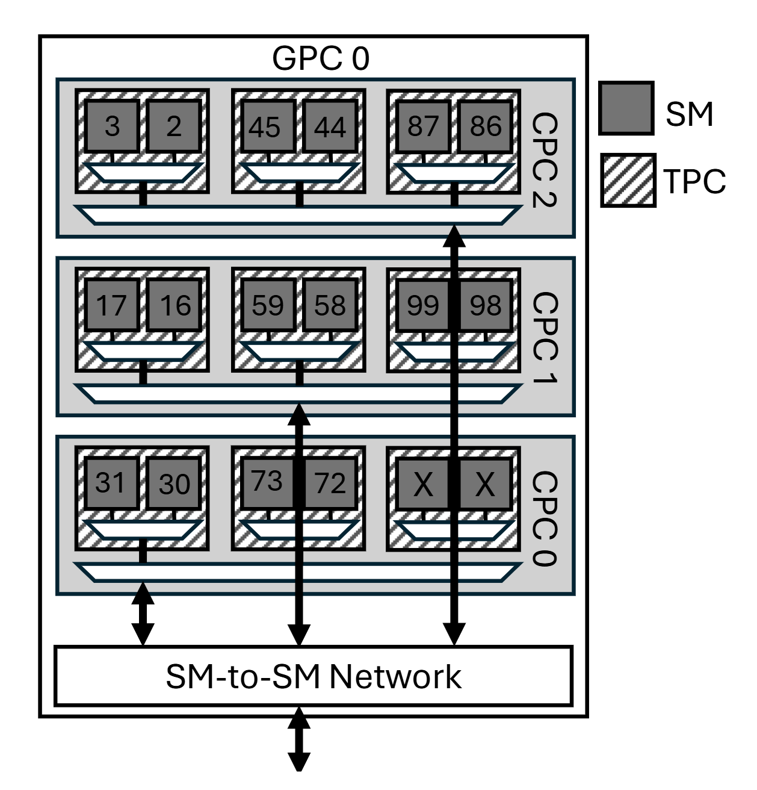

# Mixed‑Traffic Benchmark (L2 vs. SM‑to‑SM)

## Overview

This benchmark is designed to evaluate the interaction and potential contention between two types of memory traffic on NVIDIA Hopper GPUs:
 
- **L2 Traffic:**  
  Each block stream‑reads from a globally resident, warmed buffer (located in the L2 cache).

- **DSM Traffic (SM‑to‑SM):**  
  Each block reads from another block’s shared memory via the SM‑to‑SM interconnect.

The primary goal of these experiments is to understand if—and under what conditions—the two traffics contend with each other. For each configuration, two performance metrics can be measured:

- **Overall Bandwidth (CALC_BW):**  
  The total cycle count needed to complete the memory transfers, later used to compute bandwidth in GB/s.

- **Per-Request Latency (CALC_LATENCY):**  
  The average latency (in clock cycles) per memory request.

The benchmark leverages two H100‑specific features:

- **Distributed Shared Memory (DSM)**
- **Thread‑Block Clusters** (with a maximum cluster size of 16, guaranteed to reside on one GPC)

The experiments vary the ILP factors for each traffic type in the following cases:
  
1. **Only DSM Traffic (SM‑to‑SM):**  
   Vary `ILP_DSM` from 1, 2, 4, to 8 while disabling L2 traffic.

2. **Only L2 Traffic:**  
   Vary `ILP_L2` from 1, 2, 4, to 8 while disabling DSM traffic.

3. **Both Traffic Paths (Fixed L2 ILP = 8):**  
   Vary `ILP_DSM` from 1, 2, 4, to 8 while keeping L2 fixed.

4. **Both Traffic Paths (Fixed DSM ILP = 8):**  
   Vary `ILP_L2` from 1, 2, 4, to 8 while keeping DSM fixed.

In addition, the runtime parameters (number of clusters and block size) are set to 1 and 1024 respectively. Furthermore, the experiment allows you to easily select the role mapping used in the benchmark—for example, the default mapping or a custom mapping where rank 0 is DSM, rank 1 is L2, rank 12 is DSM, and rank 13 is L2.

---

## Prerequisites

- **CUDA Toolkit** with `nvcc` (tested with compute capability `sm_90`)
- A Unix‑like environment with a **bash** shell
- An NVIDIA H100 GPU

---

## Folder Structure

```
.
├── main.cu            # CUDA kernel and host driver for the mixed‑traffic benchmark
├── Makefile           # Build configuration; uses NVCC_DEFS for compile‑time flags
├── run.sh             # Script to compile and execute the benchmark for various configurations
├── README.md          # Project documentation (this file)
└── GPC0_MAPPING.png   # Image file showing one GPC mapping in H100 PCIe
```

---

## Compilation

The experiment uses a Makefile that incorporates compile‑time definitions via the environment variable `NVCC_DEFS`. Key definitions include:

- **CLUSTER_SIZE:** Fixed at 16.
- **ILP_L2** and **ILP_DSM:** Unrolling factors for the L2 and DSM branches.
- **ITERATIONS:** Number of outer repetitions for the DSM branch (and a scaled value for L2).
- **CALC_BW / CALC_LATENCY:** Selects the measurement mode.
- **ENABLE_L2 / ENABLE_SM2SM:** Enable or disable a given traffic path.

Additionally, two optional compile‑time flags are available:

- **DSM_DEST_OTHER_CPC:**  
  When defined, DSM traffic destinations are chosen from a different CPC than the source.  
  *Usage:* Append `-DDSM_DEST_OTHER_CPC` to the compile‑time flags.

- **READ_FULL:**  
  This flag forces each DSM read to cover the full shared memory size of the destination block instead of a fraction of it.  
  *Usage:* Append `-DREAD_FULL` to the compile‑time flags.

For example, to compile the benchmark with an ILP factor of 8 for both traffic paths and bandwidth measurement:

```bash
make clean
make NVCC_DEFS="-DILP_L2=8 -DILP_DSM=8 -DENABLE_L2=1 -DENABLE_SM2SM=1 -DCALC_BW"
```

To enable DSM destinations to be selected from a different CPC, simply add the flag:

```bash
make clean
make NVCC_DEFS="-DILP_L2=8 -DILP_DSM=8 -DENABLE_L2=1 -DENABLE_SM2SM=1 -DCALC_BW -DDSM_DEST_OTHER_CPC"
```

And to also enable full shared memory reads, add:

```bash
make clean
make NVCC_DEFS="-DILP_L2=8 -DILP_DSM=8 -DENABLE_L2=1 -DENABLE_SM2SM=1 -DCALC_BW -DDSM_DEST_OTHER_CPC -DREAD_FULL"
```

---

## Running the Experiment

The **run.sh** script automates the compilation and execution of several configurations. It uses the Makefile to build the executable and then runs experiments with the following runtime parameters:

- **Number of Clusters:** 1
- **Block Size:** 1024

### Configurations Tested

The script tests the following groups:

1. **SM2SM‑Only:**  
   - L2 disabled (`ENABLE_L2=0`)
   - Vary `ILP_DSM` in {1, 2, 4, 8} (L2 ILP fixed at 8)

2. **L2‑Only:**  
   - DSM disabled (`ENABLE_SM2SM=0`)
   - Vary `ILP_L2` in {1, 2, 4, 8} (DSM ILP fixed at 8)

3. **Both (Fixed L2 ILP = 8):**  
   - Both enabled  
   - L2 ILP fixed at 8, vary `ILP_DSM` in {1, 2, 4, 8}

4. **Both (Fixed DSM ILP = 8):**  
   - Both enabled  
   - DSM ILP fixed at 8, vary `ILP_L2` in {1, 2, 4, 8}

Each configuration is run for both **bandwidth** (CALC_BW) and **latency** (CALC_LATENCY) metrics.

### Role Mapping Selection

- **Default Role Map:**  
  Uses the built‑in mapping defined in the code.

- **Custom Role Map:**  
  For example, using `rank 0 = DSM, rank 1 = L2, rank 12 = DSM, rank 13 = L2` is achieved by modifying the `CUSTOM_ROLES` variable in **run.sh** (e.g., `CUSTOM_ROLES="2,1,0,0,0,0,0,0,0,0,0,0,2,1,0,0"`) and invoking:

  ```bash
  ./run.sh custom
  ```

If you simply run:

```bash
./run.sh
```

the default mapping will be used.

### Optional Flags via run.sh

The **run.sh** script includes command‑line options to enable or disable the optional compile‑time flags:

- `--dsmdest <1|0>`: Enable (1) or disable (0) the `DSM_DEST_OTHER_CPC` flag.
- `--readall <1|0>`: Enable (1) or disable (0) the `READ_ALL2ALL_FULL` flag.

For example, to run with the custom role map and both optional flags enabled, use:

```bash
./run.sh custom --dsmdest 1 --readall 1
```

Each run produces a uniquely named log file (and a renamed executable) stored in the `results` directory.

---

## Example Command Usage

Make **run.sh** executable:

```bash
chmod +x run.sh
```

Then run:

- **Default role map, without optional flags:**

  ```bash
  ./run.sh
  ```

- **Custom role map, with DSM_DEST_OTHER_CPC and READ_FULL enabled:**

  ```bash
  ./run.sh custom --dsmdest 1 --readall 1
  ```

The script compiles and executes all the experimental configurations and saves the logs to the `results` directory.

---

## Figure: H100 GPC Mapping

Below is a figure illustrating a GPC mapping (showing also TPC and CPC hierarchies) on an H100 PCIe GPU. Please use this as a reference for choosing which ranks will run L2 traffic versus SM‑to‑SM traffic. Ranks in a cluster are ordered from smallest to largest SM ID.



---

## Objectives

The key objective of this experiment is:

- **Contention Analysis:**  
  Determine whether contention exists between L2 and SM‑to‑SM traffic under various ILP settings and when both traffic types are active simultaneously. We suppose that both traffics need to cross the SM-to-SM network to reach their destination, and interference between the two traffics can happen depending on SM-to-SM network topology.
